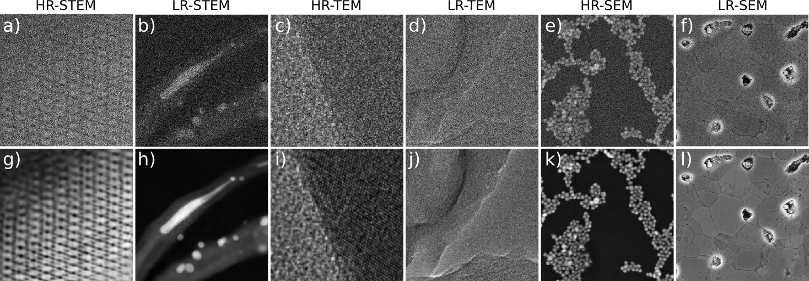

This repository is a comprehensive and adaptable collection of deep learning models specifically designed to restore and enhance various electron microscopy modalities. It offers an all-in-one solution for researchers, engineers, and electron microscopy enthusiasts looking to take advantage of the latest neural network technology to enhance the quality of their electron microscopy images.

# Deep convolutional neural networks to restore single-shot electron microscopy images
I.Lobato<sup>1,2</sup>, T. Friedrich<sup>1,2</sup>, S. Van Aert<sup>1,2</sup>

<sup>1</sup>EMAT, University of Antwerp, Department of Physics, Groenenborgerlaan 171, B-2020 Antwerp, Belgium

<sup>2</sup>NANOlab Center of Excellence, University of Antwerp, Department of Physics, Groenenborgerlaan 171, B-2020 Antwerp, Belgium

Paper: http://arxiv.org/abs/2303.17025

## Overview
State-of-the-art electron microscopes such as scanning electron microscopes (SEM), scanning transmission electron microscopes (STEM) and transmission electron microscopes (TEM) have become increasingly sophisticated. However, the quality of experimental images is often hampered by stochastic and deterministic distortions arising from the instrument or its environment. These distortions can arise during any stage of the imaging process, including image acquisition, transmission, or visualization. In this paper, we will discuss the main sources of distortion in TEM and S(T)EM images, develop models to describe them and propose a method to correct these distortions using a convolutional neural network. We demonstrate the effectiveness of our approach on a variety of experimental images and show that it can significantly improve the signal-to-noise ratio resulting in an increase in the amount of quantitative structural information that can be extracted from the image. Overall, our findings provide a powerful framework for improving the quality of electron microscopy images and advancing the field of structural analysis and quantification in materials science and biology. The source code and trained models for our approach are made available in the accompanying repository.

One of the main advantages of our image restoration method is that the training data is generated using realistic physical models of the noise found in various microscopy modalities, as well as for an appropriate range of values for the noise model parameters.  This methodology allows for the direct application of our network to experimental data, without requiring additional training for a particular specimen or microscope settings


Figure 1. Experimental image restoration for various microscopy modalities. The top row illustrates the raw experimental images, while the bottom row displays the restored versions

# Installation via Pip
To use **tk_r_em**, you need to install TensorFlow and its CUDA libraries if you want to use GPU acceleration. The specific version of TensorFlow required by **tk_r_em** depends on your operating system. It is recommended to install TensorFlow in a virtual environment to avoid conflicts with other packages.

## 1. Create a conda environment
[miniconda](https://docs.conda.io/en/latest/miniconda.html) is the recommended approach for installing TensorFlow with GPU support. It creates a separate environment to avoid changing any installed software in your system. This is also the easiest way to install the required software especially for the GPU setup.

Let us start by creating a new conda environment and activate it with the following command:

```bash
conda create -n py310_gpu python=3.10.*
conda activate py310_gpu
```

## 2. Setting up GPU (optional)
If you plan to run TensorFlow on a GPU, you'll need to install the NVIDIA GPU driver and then install CUDA and cuDNN using Conda. You can use the following command to install them::

```
conda install -c conda-forge cudatoolkit=11.2.* cudnn=8.1.*
```

To ensure that the system paths recognize CUDA when your environment is activated, you can run the following commands ([Tensorflow step by step](https://www.tensorflow.org/install/pip#linux_1)):

```bash
mkdir -p $CONDA_PREFIX/etc/conda/activate.d
echo 'export LD_LIBRARY_PATH=$LD_LIBRARY_PATH:$CONDA_PREFIX/lib/' > $CONDA_PREFIX/etc/conda/activate.d/env_vars.sh
```
These commands create a shell script in the activate.d directory, which sets the LD_LIBRARY_PATH environment variable when your environment is activated. This allows TensorFlow to locate the CUDA libraries that it needs to run on the GPU.

## 3. Install Tensorflow

### Windows
If you're using Windows, you need to install TensorFlow version 2.10.*, since it was the last TensorFlow release that supported GPU on native Windows. Starting with TensorFlow 2.11, you will need to install TensorFlow in WSL2 or install tensorflow-cpu instead. To install TensorFlow, run the following command:

```
pip install tensorflow==2.10.*
```
### Linux
If you're using Linux, install TensorFlow version 2.11.* using pip:

```
pip install tensorflow==2.11.*
```

## 4. Install tk_r_em

### Option 1: Install from PIP
After installing TensorFlow, you can install **tk_r_em** using pip:

```
pip install tk_r_em
```

This command will install the latest version of **tk_r_em** and its required dependencies.

## Option 2: Install from Git-Clone
This option is ideal if you want to edit the code. Clone the repository:

```
$ git clone https://github.com/Ivanlh20/r_em.git
```

Then, change into its directory and install it using pip:

```
pip install .
```

You are now ready to run **tk_r_em**.

## 5. Python example
Electron microscopy techniques, such as Scanning Electron Microscopy (SEM), Scanning Transmission Electron Microscopy (STEM), and Transmission Electron Microscopy (TEM), exhibit unique sources of noise and feature variations across both low and high resolutions. Consequently, we have trained our network architecture on six diverse datasets, encompassing low-resolution (LR) and high-resolution (HR) images for each microscopy modality. Our results demonstrate that optimal performance is attained by training separate networks for LR and HR features, particularly at low doses, where the network can capitalize on the specific feature distribution acquired during the training phase.

You may now incorporate **tk_r_em** into your Python code.

**The first example demonstrates the application of restoration on simulated data:**

```python
import os
import matplotlib

# Check if running on remote SSH and use appropriate backend for matplotlib
remote_ssh = "SSH_CONNECTION" in os.environ
matplotlib.use('Agg' if remote_ssh else 'TkAgg')
import matplotlib.pyplot as plt

def fcn_set_gpu_id(gpu_visible_devices: str = "0") -> None:
    os.environ["CUDA_DEVICE_ORDER"] = "PCI_BUS_ID"
    os.environ['CUDA_VISIBLE_DEVICES'] = gpu_visible_devices

fcn_set_gpu_id("0")

from tk_r_em import load_network, load_sim_test_data

def fcn_inference():
    """
    Perform inference on test data using a pre-trained model and visualize the results.
    """
    # select one of the available networks from [sfr_hrsem, sfr_lrsem, sfr_hrstem, sfr_lrstem, sfr_hrtem, sfr_lrtem]
    net_name = 'sfr_hrstem'
    
    # load its corresponding data
    x, y = load_sim_test_data(net_name)

    # load its corresponding model
    r_em_nn = load_network(net_name)
    r_em_nn.summary()

    n_data = x.shape[0]
    batch_size = 8

    # run inference
    y_p = r_em_nn.predict(x, batch_size)

    fig, axs = plt.subplots(3, n_data, figsize=(48, 6))

    for ik in range(n_data):
        x_ik = x[ik, :, :, 0].squeeze()
        y_p_ik = y_p[ik, :, :, 0].squeeze()
        y_ik = y[ik, :, :, 0].squeeze()

        ir = 0
        axs[ir][ik].imshow(x_ik, cmap='viridis')
        axs[ir][ik].set_xticks([])
        axs[ir][ik].set_yticks([])
        axs[ir][ik].grid(False)
        
        if ik == 0:
            axs[ir][ik].set_ylabel(f"Detected {net_name} image", fontsize=14, )

        ir = 1
        axs[ir][ik].imshow(y_p_ik, cmap='viridis')
        axs[ir][ik].set_xticks([])
        axs[ir][ik].set_yticks([])
        axs[ir][ik].grid(False)

        if ik == 0:
            axs[ir][ik].set_ylabel(f"Restored {net_name} image", fontsize=14)
        axs[ir][ik].set_title(f'{ik}', fontsize=8)
        
        ir = 2
        axs[ir][ik].imshow(y_ik, cmap='viridis')
        axs[ir][ik].set_xticks([])
        axs[ir][ik].set_yticks([])
        axs[ir][ik].grid(False)

        if ik == 0:
            axs[ir][ik].set_ylabel(f"Ground truth {net_name} image", fontsize=14)

    fig.subplots_adjust(hspace=2, wspace=10)
    fig.tight_layout()
    
    if remote_ssh:
        plt.savefig(f"restored_{net_name}.png", format='png')
    else:
        fig.show()

    print(ik)

if __name__ == '__main__':
    fcn_inference()
```

The above function in the code loads pre-trained neural networks corresponding to various electron microscopy techniques, including High-Resolution Scanning Electron Microscopy (HRSEM), Low-Resolution Scanning Electron Microscopy (LRSEM), High-Resolution Scanning Transmission Electron Microscopy (HRSTEM), Low-Resolution Scanning Transmission Electron Microscopy (LRSTEM), High-Resolution Transmission Electron Microscopy (HRTEM), and Low-Resolution Transmission Electron Microscopy (LRTEM). The function then loads test data for each of the networks and runs inference on the data using the corresponding neural network.

Figures 2 and 3 display the output images produced by the code using the pre-trained networks for HRSTEM and LRSTEM, respectively.


Figure 2 displays simulated images that closely resemble those obtained through High-Resolution Scanning Transmission Electron Microscopy (HRSTEM). The first row depicts the input images, the second row exhibits the restored images, and the third row row the ground truth images.


Figure 3 illustrates simulated images that closely resemble those obtained through Low-Resolution Scanning Transmission Electron Microscopy (LRSTEM). The first row depicts the input images, the second row exhibits the restored images, and the third row displays the ground truth images.

**The second example demonstrates the application of restoration on experimental HRSTEM data:**

```python
import os
import matplotlib

# Check if running on remote SSH and use appropriate backend for matplotlib
remote_ssh = "SSH_CONNECTION" in os.environ
matplotlib.use('Agg' if remote_ssh else 'TkAgg')
import matplotlib.pyplot as plt

def fcn_set_gpu_id(gpu_visible_devices: str = "0") -> None:
    os.environ["CUDA_DEVICE_ORDER"] = "PCI_BUS_ID"
    os.environ['CUDA_VISIBLE_DEVICES'] = gpu_visible_devices

fcn_set_gpu_id("0")

from tk_r_em import load_network, load_hrstem_exp_test_data

def fcn_inference():
    """
    Perform inference on test data using a pre-trained model and visualize the results.
    """
    # select one of the available networks from [sfr_hrsem, sfr_lrsem, sfr_hrstem, sfr_lrstem, sfr_hrtem, sfr_lrtem]
    net_name = 'sfr_hrstem'
    
    # load experimental hrstem data
    x = load_hrstem_exp_test_data('exp_hrstem')
        
    # load its corresponding model
    r_em_nn = load_network(net_name)
    r_em_nn.summary()

    n_data = x.shape[0]
    batch_size = 8

    # run inference
    y_p = r_em_nn.predict(x, batch_size)

    fig, axs = plt.subplots(2, n_data, figsize=(48, 6))

    for ik in range(n_data):
        x_ik = x[ik, :, :, 0].squeeze()
        y_p_ik = y_p[ik, :, :, 0].squeeze()

        ir = 0
        axs[ir][ik].imshow(x_ik, cmap='hot')
        axs[ir][ik].set_xticks([])
        axs[ir][ik].set_yticks([])
        axs[ir][ik].grid(False)
        
        if ik == 0:
            axs[ir][ik].set_ylabel(f"Experimental {net_name} image", fontsize=14, )

        ir = 1
        axs[ir][ik].imshow(y_p_ik, cmap='hot')
        axs[ir][ik].set_xticks([])
        axs[ir][ik].set_yticks([])
        axs[ir][ik].grid(False)

        if ik == 0:
            axs[ir][ik].set_ylabel(f"Restored {net_name} image", fontsize=14)

    fig.subplots_adjust(hspace=2, wspace=10)
    fig.tight_layout()
    
    if remote_ssh:
        plt.savefig(f"restored_{net_name}.png", format='png')
    else:
        fig.show()

    print('Done')

if __name__ == '__main__':
    fcn_inference()
```

The above function in the code loads pre-trained neural networks and the test data corresponding High-Resolution Scanning Transmission Electron Microscopy (HRSTEM). The output images produced by the code are show in Figure 8.


Figure 4 showcases experimental images obtained through HRSTEM. The first row displays the input images, while the second row shows the restored images. The first and second columns correspond to experimental images taken by Zezhong Zang, the third and fourth columns correspond to experimental images published in a Nature paper by Sandra Van Aert. The last column displays a low-dose experimental drift-corrected HRSTEM image of the SrTiO3 sample.

**As a final example, we demonstrated how our network can restore a single image on a GPU with limited memory**

In case you encounter a memory error while running the **r_em_nn.predict(x)** function on an image, you can try using **r_em_nn.predict_patch_based(x)** instead to restore the image. This function uses a window-based patch method, which involves dividing the image into smaller, overlapping patches and processing each patch separately.

The window size and stride determine the size of the patches and the amount of overlap between them. By using overlapping patches, the neural network can better capture the spatial features within each patch, resulting in improved image restoration.

After the neural network has processed each patch, the restored image is then reconstructed by combining the individual patches. This approach allows for processing large images that may not fit into the GPU's memory, making it a useful function for restoring high-resolution images on a memory-constrained GPU.

```python
import os
import matplotlib

# Check if running on remote SSH and use appropriate backend for matplotlib
remote_ssh = "SSH_CONNECTION" in os.environ
matplotlib.use('Agg' if remote_ssh else 'TkAgg')
import matplotlib.pyplot as plt

def fcn_set_gpu_id(gpu_visible_devices: str = "0") -> None:
    os.environ["CUDA_DEVICE_ORDER"] = "PCI_BUS_ID"
    os.environ['CUDA_VISIBLE_DEVICES'] = gpu_visible_devices

fcn_set_gpu_id("0")

from tk_r_em import load_network, load_hrstem_exp_test_data

def fcn_inference():
    """
    Perform inference on test data using a pre-trained model and visualize the results.
    """
    # select one of the available networks from [sfr_hrsem, sfr_lrsem, sfr_hrstem, sfr_lrstem, sfr_hrtem, sfr_lrtem]
    net_name = 'sfr_hrstem'
    
    # load experimental hrstem data
    x = load_hrstem_exp_test_data('sgl_exp_hrstem')
        
    # load its corresponding model
    r_em_nn = load_network(net_name)
    r_em_nn.summary()

    # run inference
    y_p = r_em_nn.predict_patch_based(x, patch_size=256, stride=128, batch_size=16)

    fig, axs = plt.subplots(1, 2, figsize=(48, 6))
    ir = 0
    axs[ir].imshow(x, cmap='hot')
    axs[ir].set_xticks([])
    axs[ir].set_yticks([])
    axs[ir].grid(False)
    axs[ir].set_title(f"Experimental {net_name} image", fontsize=14, )

    ir = 1
    axs[ir].imshow(y_p, cmap='hot')
    axs[ir].set_xticks([])
    axs[ir].set_yticks([])
    axs[ir].grid(False)
    axs[ir].set_title(f"Restored {net_name} image", fontsize=14)

    fig.subplots_adjust(hspace=2, wspace=10)
    fig.tight_layout()
    
    if remote_ssh:
        plt.savefig(f"restored_{net_name}.png", format='png')
    else:
        fig.show()

    print('Done')

if __name__ == '__main__':
    fcn_inference()
```

Figure 5 showcases an HRSTEM experimental image and its restored version obtained by using the window-patch-based prediction method. The left column displays the original experimental HRSTEM image taken by Zezhong Zang, while the right column shows the restored image.

## 5. Performance
All models of **tk_r_em** have been optimized to run on a standard desktop computer, and its performance can be significantly improved by utilizing GPU acceleration.

## 6. How to cite:
**Please cite tk_r_em in your publications if it helps your research:**

```bibtex
@article{Lobato2023,
   author = {I. Lobato and T. Friedrich and S. Van Aert},
   month = {3},
   title = {Deep convolutional neural networks to restore single-shot electron microscopy images},
   url = {https://arxiv.org/abs/2303.17025v1},
   year = {2023},
}
```
