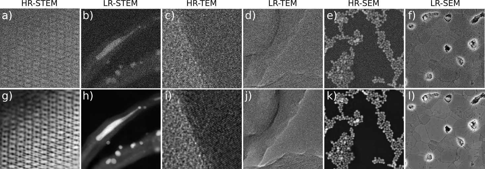
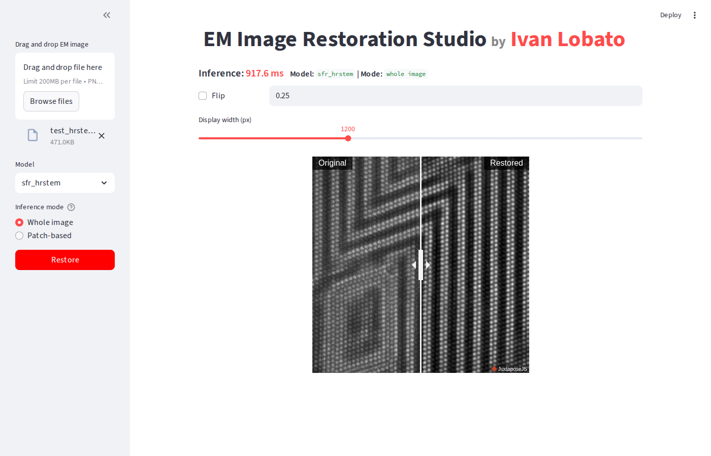

# Deep convolutional neural networks to restore single-shot electron microscopy images

I. Lobato¹², T. Friedrich¹², S. Van Aert¹²

¹ EMAT, University of Antwerp, Department of Physics, Groenenborgerlaan 171, B-2020 Antwerp, Belgium

² NANOlab Center of Excellence, University of Antwerp, Department of Physics, Groenenborgerlaan 171, B-2020 Antwerp, Belgium

Paper: https://www.nature.com/articles/s41524-023-01188-0

## Overview

**tk_r_em** provides six pre-trained deep learning models that restore and enhance single-shot electron microscopy images across three modalities — SEM, STEM, and TEM — at both high and low resolution. The models ship as lightweight ONNX files and run on CPU, NVIDIA GPU, or DirectML (AMD/Intel/Qualcomm on Windows) with no TensorFlow dependency.

| Tag            | Modality | Resolution |
| -------------- | -------- | ---------- |
| `sfr_hrsem`  | SEM      | High       |
| `sfr_lrsem`  | SEM      | Low        |
| `sfr_hrstem` | STEM     | High       |
| `sfr_lrstem` | STEM     | Low        |
| `sfr_hrtem`  | TEM      | High       |
| `sfr_lrtem`  | TEM      | Low        |


*Figure 1. Experimental image restoration for various microscopy modalities. Top row: raw experimental images. Bottom row: restored versions.*

## Scientific motivation

### The problem: distortions in electron microscopy

Advanced electron microscopy techniques — SEM, STEM, and TEM — have revolutionised imaging capabilities, yet achieving high-quality experimental images remains a challenge due to various distortions stemming from the instrumentation and external factors. These distortions are introduced at different stages of the imaging process and hinder the extraction of reliable quantitative insights.

In **TEM**, the dominant sources of degradation include specimen damage from high-energy electron beams and noise introduced during image acquisition and transmission. In **SEM** images, surface condition and detector characteristics affect the achievable signal-to-noise ratio. **STEM** images are particularly susceptible to scan distortions — two-dimensional random displacements of pixel rows caused by environmental vibrations and electrical instabilities — as well as severe noise arising from the sequential nature of pixel-by-pixel data collection. Across all modalities, the detector itself introduces noise that depends on the detector type, beam current, and experimental conditions.

The standard approach for improving signal-to-noise is to average a series of sequential images; however, this requires considerable beam time and may increase cumulative specimen damage. Alternative techniques such as Wiener filtering or BM3D denoising can reduce noise but may introduce artefacts or fail to recover fine structural detail.

### Our approach: physics-based training with deep learning

We develop a **deep convolutional neural network** approach to restore single-shot EM images, eliminating the need for multi-frame averaging. The key innovation is a realistic synthetic training pipeline: all training data is generated using physical models of the noise found in each microscopy modality, implemented through the [MULTEM](https://github.com/Ivanlh20/MULTEM) multislice simulator. The noise chain faithfully reproduces detector noise, shot noise, dark current, thermal noise, fast-scan distortions, and quantisation artefacts for a comprehensive range of parameter values.

This physics-based methodology allows the network to capitalise on the specific feature distribution of each modality during training, enabling direct application to experimental data from any microscope **without requiring retraining** for a particular specimen or instrument setting.

### Architecture

Each of the six networks uses a **Concatenated Grouped Residual Dense Network (CGRDN)** generator — a compact architecture with only 7.04M parameters (seven times fewer than comparable architectures such as MR-UNET) — paired with a relativistic PatchGAN discriminator. Training employs an 11-loss basket combining L1, multi-level wavelet transform (MLWT), FFT-based spectral, mean, standard deviation, gradient, and adversarial losses to jointly optimise pixel-level fidelity, perceptual quality, and structural similarity.

### Results

Validation on both simulated and experimental data demonstrates that the networks significantly enhance the signal-to-noise ratio, outperforming the widely-used BM3D algorithm by a margin of 6.51 dB on the validation dataset. This improvement leads to a more reliable extraction of quantitative structural information, enabling:

- Accurate determination of atomic column positions with sub-angstrom precision
- Reliable extraction of scattering cross-sections at atomic resolution
- Precise measurement of specimen thickness from single-shot images
- Consistent enhancement across diverse material systems, including crystalline structures, precipitates, and amorphous materials

# Installation

Install inside a virtual environment to keep tk_r_em's dependencies isolated. Two environment managers are supported:

- **venv** — built into Python, no additional install required.
- **conda / miniconda** — a cross-platform package and environment manager. If you do not have it installed, download [Miniconda](https://docs.conda.io/en/latest/miniconda.html) — a minimal installer that bundles Python and conda — for your platform first.

Start by cloning the repository (once, regardless of backend):

```bash
git clone https://github.com/Ivanlh20/tk_r_em.git
cd tk_r_em
```

## Create and activate a virtual environment

Pick whichever you prefer; both produce an isolated Python 3.10 environment.

<details open>
<summary><strong>venv</strong> (built-in Python)</summary>

```bash
python -m venv tk_r_em
source tk_r_em/bin/activate   # Windows: tk_r_em\Scripts\activate
pip install --upgrade pip
```
</details>

<details>
<summary><strong>conda / miniconda</strong></summary>

```bash
conda create -n tk_r_em python=3.10 -y
conda activate tk_r_em
```
</details>

> **Want CPU and GPU side by side?** Suffix the env name (`tk_r_em_cpu`, `tk_r_em_gpu`, `tk_r_em_directml`) and create one env per backend — the three `onnxruntime` builds install into the same Python package directory and cannot coexist in a single environment.

## Install the runtime

Pick **one** ONNX Runtime build for your hardware.

### CPU (Linux, Windows, macOS)

```bash
pip install -e ".[cpu]"
```

Works identically on Linux, Windows, and macOS (Intel and Apple Silicon). Pulls in the CPU-only `onnxruntime` build.

### NVIDIA GPU (Linux, Windows)

Prerequisite: a recent NVIDIA driver (check with `nvidia-smi`).

```bash
pip install -e ".[gpu]"
```

This installs `onnxruntime-gpu` **plus** the NVIDIA CUDA 12.x / cuDNN 9.x pip wheels into the same environment. tk_r_em calls `onnxruntime.preload_dlls()` at import time, so the wheel-installed libraries are dlopen'd before any ONNX session is created — no `LD_LIBRARY_PATH` fiddling required.

If you are upgrading an existing CPU-only environment, remove the CPU wheel first (the two builds install into the same package directory and cannot coexist):

```bash
pip uninstall -y onnxruntime
pip install --upgrade ".[gpu]"
```

### AMD / Intel / Qualcomm GPU on Windows (DirectML)

Windows users who do not have an NVIDIA GPU can use the **DirectML execution provider**, which targets any DirectX 12 capable device — AMD Radeon, Intel Arc/UHD/Iris, NVIDIA GeForce, and Qualcomm Adreno GPUs released in the last several years.

```bash
pip install -e ".[directml]"
```

This installs `onnxruntime-directml`. tk_r_em auto-detects the DirectML provider at import time and sets the two session options DirectML requires (`enable_mem_pattern=False`, `ORT_SEQUENTIAL` execution) — no manual configuration needed.

Pinning a specific DX12 adapter is done from Windows' **Settings → System → Display → Graphics** panel; ORT does not respect `CUDA_VISIBLE_DEVICES` for DirectML.

> **⚠️ Untested on AMD hardware.** The DirectML code path is wired into tk_r_em and the NVIDIA / CPU paths are regression-tested, but the maintainers have no AMD GPU on hand to validate DirectML end-to-end. Confirmed working reports (or issues) are welcome at [https://github.com/Ivanlh20/tk_r_em/issues](https://github.com/Ivanlh20/tk_r_em/issues).

> **Linux AMD support.** ROCm and MIGraphX are not exposed by tk_r_em. A `[gpu-amd-linux]` extra is on the roadmap.

## Why do I have to pick `[cpu]`, `[gpu]`, or `[directml]`?

The three ONNX Runtime builds — `onnxruntime`, `onnxruntime-gpu`, and `onnxruntime-directml` — all install into the **same** Python package directory and cannot coexist. tk_r_em therefore does not hard-depend on any of them; you must pick exactly one extra. Plain `pip install -e .` succeeds but raises a clear `ImportError` at first import, listing the extras you can choose from.

Verify that the expected execution provider is visible:

```python
import tk_r_em                    # triggers ort.preload_dlls() internally
import onnxruntime as ort
print(ort.get_available_providers())
# NVIDIA GPU build:
# ['TensorrtExecutionProvider', 'CUDAExecutionProvider', 'CPUExecutionProvider']
# DirectML build:
# ['DmlExecutionProvider', 'CPUExecutionProvider']
# CPU build:
# ['CPUExecutionProvider']
```

tk_r_em picks CUDA → DirectML → CPU in that order at session-creation time and falls back silently if the first choice is unavailable (e.g. `CUDA_VISIBLE_DEVICES=-1`, no DX12 adapter). The `.summary()` method prints the **resolved** device — `cuda`, `directml`, or `cpu` — so you can confirm what is running. To pin a specific NVIDIA GPU, set `CUDA_VISIBLE_DEVICES` **before** importing tk_r_em; to force CPU, set it to `-1`:

```python
import os
os.environ["CUDA_DEVICE_ORDER"]    = "PCI_BUS_ID"
os.environ["CUDA_VISIBLE_DEVICES"] = "0"   # or "-1" to force CPU
from tk_r_em import load_network
```

| Platform                                  | CPU       | NVIDIA GPU              | Other GPUs                                                                         |
| ----------------------------------------- | --------- | ----------------------- | ---------------------------------------------------------------------------------- |
| **Linux**                           | supported | CUDA —`tk_r_em[gpu]` | not yet (ROCm/MIGraphX on roadmap)                                                 |
| **Windows**                         | supported | CUDA —`tk_r_em[gpu]` | DirectML —`tk_r_em[directml]` (any DX12 GPU; **untested by maintainers**) |
| **macOS** (Intel and Apple Silicon) | supported | n/a                     | CPU only                                                                           |

<details>
<summary><strong>Troubleshooting</strong></summary>

| Symptom                                                                     | Cause                                                                    | Fix                                                                                                              |
| --------------------------------------------------------------------------- | ------------------------------------------------------------------------ | ---------------------------------------------------------------------------------------------------------------- |
| `.summary()` prints `Device: cpu` on a GPU machine                      | Both `onnxruntime` and `onnxruntime-gpu` installed — CPU wins       | `pip uninstall -y onnxruntime && pip install --force-reinstall --no-deps onnxruntime-gpu`                      |
| `libcudnn.so.9: cannot open shared object file`                           | cuDNN 9 missing or not on linker path                                    | Reinstall via `pip install ".[gpu]"`; make sure `preload_dlls()` runs (tk_r_em ≥ 2.0)                       |
| `Failed to create CUDAExecutionProvider. Require cuDNN 9.* and CUDA 12.*` | Mismatched runtime (e.g. cuDNN 8, CUDA 11)                               | `pip install "nvidia-cudnn-cu12>=9.0" "nvidia-cuda-runtime-cu12>=12.0"`                                        |
| DirectML:`.summary()` prints `Device: cpu` on Windows                   | A CPU or GPU `onnxruntime` wheel is shadowing `onnxruntime-directml` | `pip uninstall -y onnxruntime onnxruntime-gpu && pip install --force-reinstall --no-deps onnxruntime-directml` |
| DirectML:`DirectMLExecutionProvider is not in available providers`        | Not on Windows, or wrong wheel                                           | DirectML is**Windows only**. Install with `pip install ".[directml]"`                                    |

</details>

## Install from a local clone

Ideal if you want to edit the code. After cloning (see above), install in editable mode:

```bash
pip install -e ".[cpu]"      # or .[gpu] / .[directml]
```

## Running the bundled notebooks

The [`tutorials/`](tutorials/) directory ships two tutorial notebooks:

- [`01_introduction.ipynb`](tutorials/01_introduction.ipynb) — CNN basics and single-shot EM image restoration.
- [`02_tem_ml_workshop_artemi_2024_10_28.ipynb`](tutorials/02_tem_ml_workshop_artemi_2024_10_28.ipynb) — full workshop walkthrough from the [ARTEMI *Workshop on machine learning methods in transmission electron microscopy*](https://artemi.se/workshop-on-machine-learning-methods-in-transmission-electron-microscopy/) held at Linköping University on 28–29 October 2024: network loading, whole-image / patch-based / batch inference, video synthesis, metrics.

The workshop slide deck sits next to the notebook at [`tutorials/tem_ml_workshop_artemi_2024_10_28_slides.pptx`](tutorials/tem_ml_workshop_artemi_2024_10_28_slides.pptx); notebook input data is under [`tutorials/data/`](tutorials/data/) and video inputs under [`tutorials/media/`](tutorials/media/). All dependencies (`ipykernel`, `imageio`, `imageio-ffmpeg`, `tqdm`, `scikit-image`) are pulled in automatically by every runtime extra above (`[cpu]`, `[gpu]`, `[directml]`) — no extra install step.

# Quick start

```python
from tk_r_em import load_network, load_sim_test_data

net = load_network('sfr_hrstem')
net.summary()

x, y = load_sim_test_data('sfr_hrstem')
y_p = net.predict(x, batch_size=8)
print(f'Input: {x.shape}  Output: {y_p.shape}')
```

For large images that do not fit in GPU memory, use patch-based inference:

```python
from tk_r_em import load_network, load_hrstem_exp_test_data

net = load_network('sfr_hrstem')
x = load_hrstem_exp_test_data('sgl_exp_hrstem')
y_p = net.predict_patch_based(x, patch_size=256, stride=128, batch_size=16)
```

# Python examples

Four complete example scripts are included:

| Script                                                      | Description                                        |
| ----------------------------------------------------------- | -------------------------------------------------- |
| [`example_sim_data.py`](example_sim_data.py)                | Simulated data: detected / restored / ground truth |
| [`example_exp_batch_data.py`](example_exp_batch_data.py)    | Experimental HRSTEM batch                          |
| [`example_exp_patch_data.py`](example_exp_patch_data.py)    | Large image via patch-based inference              |
| [`example_exp_single_data.py`](example_exp_single_data.py)  | Large image in a single forward pass               |

## Example 1 — Simulated data

Source: [`example_sim_data.py`](example_sim_data.py). Loads a bundled simulated test set with `load_sim_test_data(net_name)`, which returns a pair `(x, y)` of eight 256×256 images — `x` is the distorted input produced by the physical-model simulator and `y` is the MULTEM ground truth. Inference is run with `net.predict(x, batch_size=8)`, where `batch_size` sets how many images go through the network per forward pass. Change `net_name` to any of the six modality tags (`sfr_hrsem`, `sfr_lrsem`, `sfr_hrstem`, `sfr_lrstem`, `sfr_hrtem`, `sfr_lrtem`) to swap models. The script prints total time, per-image latency, and throughput, then plots three rows — detected / restored / ground truth — so you can visually compare the network output against the reference.


*Figure 2. Simulated HRSTEM images. Top: noisy input. Middle: restored. Bottom: ground truth.*


*Figure 3. Simulated LRSTEM images. Top: noisy input. Middle: restored. Bottom: ground truth.*

## Example 2 — Experimental HRSTEM batch

Source: [`example_exp_batch_data.py`](example_exp_batch_data.py). Loads a batch of five real 768×768 experimental HRSTEM images via `load_hrstem_exp_test_data('exp_hrstem')` — no ground truth is available for experimental data, so only `x` is returned. Inference runs in one call:

```python
y_p = net.predict(x, batch_size=8)
```

The **`batch_size`** argument is what controls batching: `predict` internally slices the input along the leading axis and submits `batch_size` images to the ONNX session per forward pass, concatenating the results before returning. Lower `batch_size` reduces peak GPU/CPU memory at the cost of throughput; raise it when you have spare memory. The plot shows two rows — experimental input on top, restored output on the bottom — across all five images side by side.


*Figure 4. Experimental HRSTEM images. Top: raw experimental. Bottom: restored.*

## Example 3 — Large experimental image (patch-based)

Source: [`example_exp_patch_data.py`](example_exp_patch_data.py). Loads a single 2048×2048 experimental HRSTEM image via `load_hrstem_exp_test_data('sgl_exp_hrstem')`. Runs tiled inference with three parameters:

```python
y_p = net.predict_patch_based(x, patch_size=256, stride=128, batch_size=16)
```

- **`patch_size=256`** — spatial size of each tile fed to the network (clamped internally to at least 128 and at most the image dimensions).
- **`stride=128`** — step between adjacent patch centres; `128` gives 50% overlap (the default, equal to `patch_size // 2`), so neighbouring patches share half their area.
- **`batch_size=16`** — number of patches processed per forward pass, analogous to Example 2.

Overlapping patches are blended with a separable 2D Butterworth window (`cutoff=0.33`, `order=4`) and normalised by a running weight map, so the seams between tiles are invisible in the output. Use this path whenever the image is larger than fits comfortably in memory, or larger than the 256×256 tiles the networks were trained on.


*Figure 5. Large experimental HRSTEM image. Left: original. Right: restored via patch-based inference.*

## Example 4 — Large experimental image (single forward pass)

Source: [`example_exp_single_data.py`](example_exp_single_data.py). Same 2048×2048 input as Example 3, but fed through the network in one shot:

```python
y_p = net.predict(x)
```

No `patch_size`, no `stride`, no tiling — the whole image is pushed through the ONNX session as a single `(1, 2048, 2048, 1)` tensor. This is simpler and marginally faster than Example 3 (no blending arithmetic), but it requires enough GPU/CPU memory to hold the full image plus activations; at 2048×2048 you will need roughly an order of magnitude more peak memory than the patch-based path. The result is visually indistinguishable from the patch-based output in Figure 5, which confirms that the Butterworth-windowed tiling in Example 3 does not introduce seam artefacts — the two routes are interchangeable up to memory constraints.


*Figure 6. Same large experimental HRSTEM image as Example 3, restored in a single forward pass. Left: original. Right: restored. The output is visually indistinguishable from the patch-based result in Figure 5, confirming that the Butterworth-windowed tiling produces seamless reconstructions.*

# Streamlit web app

An interactive web UI for drag-and-drop image restoration:

```bash
pip install -e ".[cpu]"   # or [gpu] / [directml]
streamlit run app.py
```

Upload an EM image (PNG, TIF, SER, DM3, DM4, EMD), select a model and inference mode (whole-image or patch-based), then click **Restore**. Results are shown in a comparison slider (drag to reveal original vs. restored) or flip mode (toggle between frames at a configurable interval).


*Figure 7. EM Image Restoration Studio — comparison slider showing original (left) and restored (right) HRSTEM image.*

# Performance

All models are optimised to run efficiently on a standard desktop computer. GPU acceleration provides a significant speed-up — typical inference times on a modern NVIDIA GPU are a few milliseconds per 256x256 image.

# How to cite

**Please cite tk_r_em in your publications if it helps your research:**

```bibtex
@article{Lobato2024,
   author  = {I. Lobato and T. Friedrich and S. Van Aert},
   doi     = {10.1038/s41524-023-01188-0},
   issn    = {2057-3960},
   issue   = {1},
   journal = {npj Computational Materials},
   title   = {Deep convolutional neural networks to restore single-shot electron microscopy images},
   volume  = {10},
   pages   = {1-19},
   url     = {https://www.nature.com/articles/s41524-023-01188-0},
   year    = {2024},
}
```
